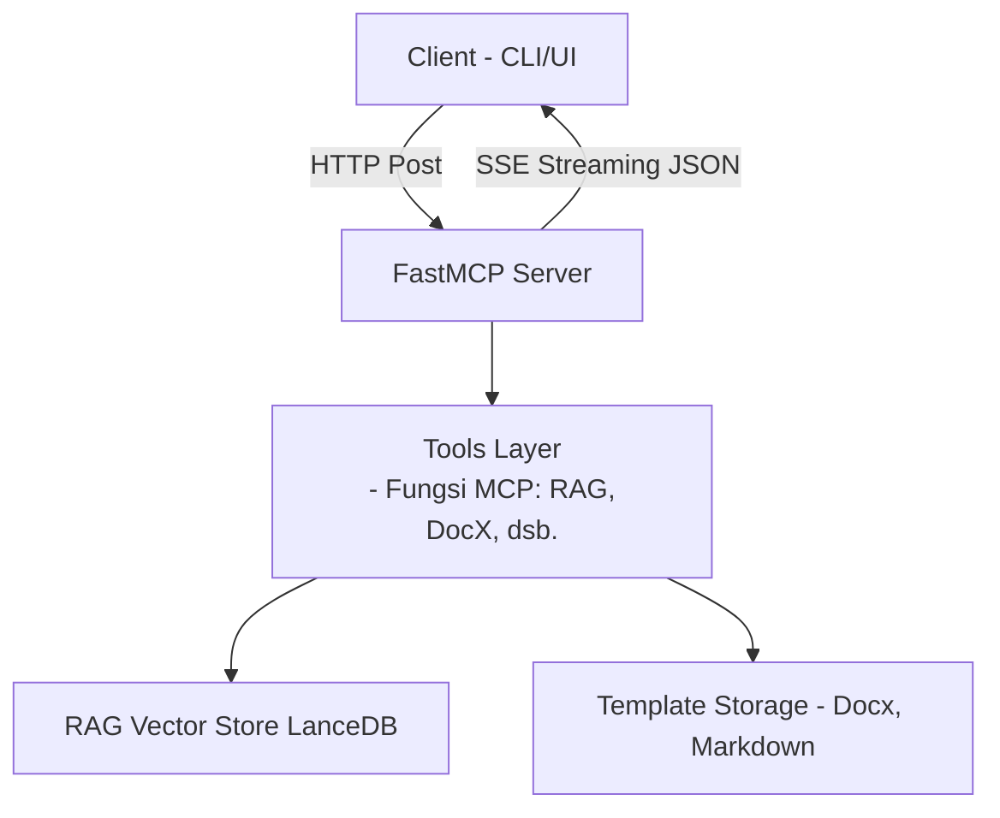

# ProjectWise – MCP Server

**ProjectWise MCP Server** adalah implementasi _Model‑Context Protocol_ (**MCP**) berbasis **Server‑Sent Events (SSE)** yang berfokus pada otomasi proses _pre‑sales_ & _project delivery_ di lingkungan enterprise. Berkas ini menjelaskan **hanya** komponen **`mcp_server/`**.

> Bahasa dokumen: **Indonesia**

---

## Fitur Utama

| Tool (nama MCP)                | Deskripsi Singkat                                                                                                                           |
| ------------------------------ | ------------------------------------------------------------------------------------------------------------------------------------------- |
| `add_product_knowledge`        | Menambahkan seluruh file PDF di `data/product_standard/` ke _vector store_ sebagai _product knowledge_.                                     |
| `add_kak_tor_knowledge`        | Mengonversi PDF KAK/TOR menjadi markdown lalu mengindeksnya ke RAG.                                                                         |
| `add_kak_tor_md_knowledge`     | Mengindeks langsung berkas markdown KAK/TOR (tanpa konversi PDF).                                                                           |
| `build_instruction_context`    | Menggabungkan _prompt template_ dengan konteks KAK/TOR terpilih untuk _LLM reasoning_.                                                      |
| `rag_retrieval`                | Pencarian similarity + filter metadata di vectorstore dan mengembalikan teks yang relevan dengan _citation_.                                |
| `reset_vectordb`               | Menghapus seluruh isi vectorstore dan membuat tabel kosong baru.                                                                            |
| `update_chunk_metadata`        | Memperbarui metadata chunk (mis. `project`, `tahun`).                                                                                       |
| `get_vectorstore_stats`        | Statistik dokumen, token, dan embeddings saat ini.                                                                                          |
| `rebuild_all_embeddings`       | Menghitung ulang embeddings untuk semua chunk (setelah ganti model).                                                                        |
| `list_metadata_values`         | Menampilkan nilai unik suatu field metadata.                                                                                                |
| `retrieve_product_context`     | Mengambil konteks produk tertentu via RAG (untuk proposal).                                                                                 |
| `extract_document_text`        | Mengekstrak teks dari `.pdf`, `.docx`, atau `.md` ke markdown.                                                                              |
| `generate_proposal_docx`       | Merender proposal Word `.docx` berdasarkan _context_ & template.                                                                            |
| `build_summary_tender_payload` | Menggabungkan prompt instruction (template .txt) dengan satu file Markdown KAK/TOR, lalu mengembalikan dict {"instruction":…, "context":…}. |

> Seluruh _tools_ dideklarasikan dengan dekorator `@mcp.tool` di `server.py` dan secara otomatis diekspor melalui SSE endpoint.

---

## Arsitektur Singkat



---

## Persyaratan

- Python **3.11+**
- Paket Python (lihat `pyproject.toml`):

  - `docling`, `langchain`, `lancedb`, `openai`, dll.
  - Lihat _dependency_ lengkap di bagian [Dependencies](#dependencies).

- **LanceDB** (embedded, otomatis dibuat).
- Kunci API OpenAI **`OPENAI_API_KEY`** (atau endpoint lain bila menggunakan `ollama_host`).

---

## Instalasi Cepat

```bash
git clone https://github.com/deckiokmal/MCP_SERVER-Agentic-RAG.git
cd projectwise_server

# buat virtualenv & aktifkan
uv venv
source .venv/bin/activate  # Windows: .venv\\Scripts\\activate

# instal dependensi
uv run

# salin contoh .env & edit
cp .env.example .env
nano .env   # isi OPENAI_API_KEY, OLLAMA_HOST, dsb.
```

---

## Konfigurasi (`settings.py`)

Variabel utama (dibaca via **Pydantic Settings**):

| Nama                 | Default                  | Keterangan                       |
| -------------------- | ------------------------ | -------------------------------- |
| `OPENAI_API_KEY`     | -                        | Kunci API OpenAI.                |
| `OLLAMA_HOST`        | `http://localhost:11434` | Host LLM self‑hosted (opsional). |
| `COLLECTION_NAME`    | `projectwise_knowledge`  | Nama tabel vectorstore.          |
| `CHUNK_SIZE`         | `200` token              | Panjang chunk RAG.               |
| `RETRIEVER_SEARCH_K` | `5`                      | Jumlah top-k hasil retrieval.    |

Lihat file `mcp_server/settings.py` untuk daftar lengkap.

---

## Menjalankan Server

```bash
python main.py
# atau
python -m mcp_server.server
```

Secara bawaan server berjalan di `http://localhost:5000` dengan SSE transport.
Setiap tool dapat dipanggil via protokol MCP; contoh payload:

```jsonc
{
  "tool": "rag_retrieval",
  "args": {
    "query": "ringkasan solusi DWDM",
    "metadata_filter": { "project": "DWDM-2025" }
  }
}
```

---

## Struktur Direktori (Server)

```
mcp_server/
├── logs/
├── data/
│   ├── kak_tor/            # PDF sumber KAK/TOR
│   ├── kak_tor_md/         # Markdown hasil konversi
│   ├── product_standard/   # PDF atau MD knowledge produk
│   ├── templates/          # .docx template proposal
│   └── proposal_generated/ # Output proposal
├── prompts/                # Prompt template untuk LLM
├── tools/
│   ├── rag_tools.py
│   └── docx_tools.py
├── utils/
│   ├── rag_pipeline.py
│   └── docx_generator.py
├── settings.py
└── server.py
```

---

## Dependencies

```text
docling>=2.40.0
docxtpl>=0.20.0
lancedb>=0.24.0
langchain>=0.3.26
langchain-community>=0.3.27
langchain-openai>=0.3.27
mcp[cli]>=1.10.1
openai>=1.93.0
pyarrow>=14.0.0
```

---

## Lisensi

Proyek ini menggunakan lisensi **MIT**. Lihat berkas `LICENSE` untuk detail.

---

## Kontribusi

1. _Fork_ repositori & buat _feature branch_.
2. Jalankan `pre-commit` untuk formatting & linting.
3. Buat _pull request_ dengan deskripsi jelas.

Please collab !
