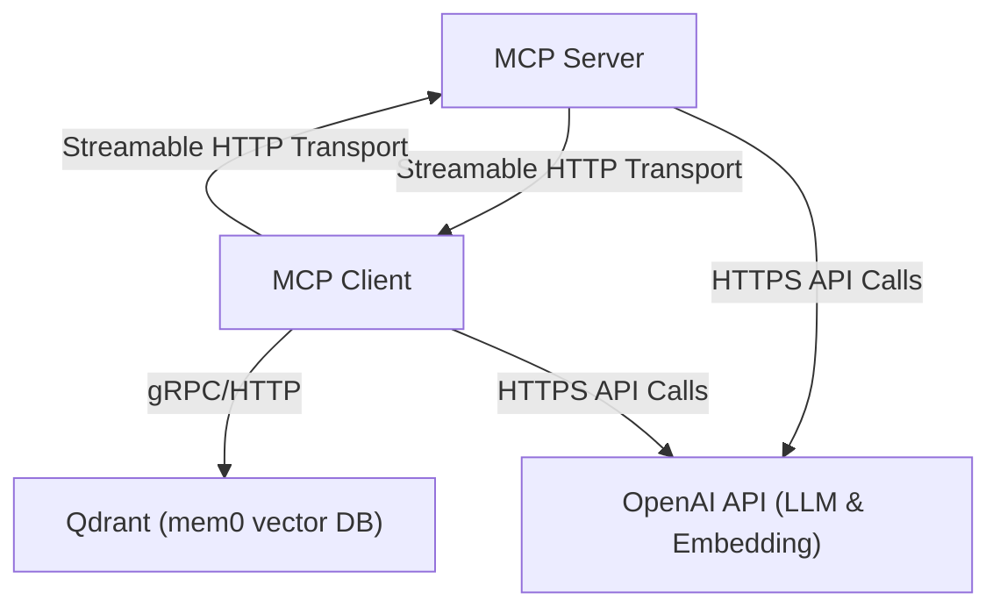

## **Arsitektur / Topologi**


## Docker Build

Berikut **Dockerfile satu-stage** yang menggunakan uv sebagai package manager, meng­install dependensi dari pyproject.toml:

```dockerfile
# Dockerfile
FROM python:3.13-slim

# 1. Disable pyc & unbuffered logs
ENV PYTHONDONTWRITEBYTECODE=1
ENV PYTHONUNBUFFERED=1

# 2. Tambah ~/.local/bin ke PATH supaya uv bisa dipakai
ENV PATH="/root/.local/bin:${PATH}"

# 3. Install curl → unduh & pasang uv → symlink ke /usr/local/bin
RUN apt-get update \
 && apt-get install -y --no-install-recommends curl \
 && rm -rf /var/lib/apt/lists/* \
 && curl -LsSf https://astral.sh/uv/install.sh | sh \
 && ln -s /root/.local/bin/uv /usr/local/bin/uv

# 4. Set working dir
WORKDIR /projectwise_mcpserver

# 5. Copy file dependency
COPY pyproject.toml ./
COPY uv.lock ./

# 6. Sync deps (non-dev)
RUN uv sync --no-dev

# 7. Copy seluruh kode aplikasi
COPY . .

# 8. Expose port yang dipakai app
EXPOSE 5000

# 9. Jalankan Flask via uv
CMD ["uv", "run", "main.py"]
```

---

## Langkah-langkah Build & Push ke Docker Hub

1. **Masuk ke direktori project**

   ```bash
   cd /path/to/your/project  # di mana Dockerfile dan folder projectwise_flaskui/ berada
   ```

2. **Tambahkan .dockerignore untuk file .env di dalam projectwise_flaskui/.env**

   ```dockerignore
   # Ignore file .env di dalam folder
   .env

   # (Opsional) Ignore semua file env di subfolder manapun
   **/*.env

   .venv/
   docs/
   lancedb_storage/
   logs/
   ```

2. **Login ke Docker Hub**

   ```bash
   docker login
   # Username: deckiokmal
   # Password: <Docker Hub password Anda>
   ```

3. **Build image Docker**

   ```bash
   docker build -t deckiokmal/projectwise_mcpserver:latest .
   ```

4. **Verifikasi image lokal**

   ```bash
   docker images deckiokmal/projectwise_mcpserver
   ```

   Pastikan tag `latest` muncul.

5. **Push image ke Docker Hub**

   ```bash
   docker push deckiokmal/projectwise_mcpserver:latest
   ```

6. **Cek di Docker Hub**
   Buka

   ```
   https://hub.docker.com/r/deckiokmal/projectwise_mcpserver
   ```

   dan pastikan tag `latest` sudah ter­upload.

7. **(Opsional) Jalankan container untuk testing**

    1. Siapkan file `.env` di host
    Di direktori project (sisi host), buat file `.env` misalnya:

        ```
        OPENAI_API_KEY="openai-api-key"
        OLLAMA_HOST=http://ollama.prod:11434
        TAVILY_API_KEY="tavily-api-key"
        ```

    Anda bebas menambahkan atau override variabel apa pun yang di-`MCPSettings`.

    2. Mount `.env` ke path yang di‐load aplikasi
    Kode Anda mencari `.env` di `/app/.env` (karena `parent.parent` dari modul). Maka jalankan container dengan *volume* mount:

        ```bash
        docker run -d --name projectwise_mcpserver -p 5000:5000 --env-file .env deckiokmal/projectwise_mcpserver:latest
        ```

    – `-v host-path:container-path`
    – Pastikan `$(pwd)/.env` adalah path ke file `.env` Anda

    Dengan ini, Pydantic akan mem‐load variabel dari file mounted tersebut.

---

Dengan ini image Anda akan berisi:

* **Python 3.13** sebagai runtime
* **uv** untuk manajemen dependensi (sinkronisasi dari pyproject.toml)
* **Build image** tanpa `.env`
* **Jalankan** container dengan opsi mount file .env untuk konfigurasi
* Aplikasi Anda tetap membaca `MCPSettings` dari variabel luar container

---
## Troubleshoot
1. Pastikan jika menjalan client dan server di docker host yang sama, gunakan URL server: host.docker.internal:5000/


## Docker Compose

```yaml
services:
  # -------------------------------
  # Aplikasi Projectwise MCP Server
  # -------------------------------
  app:
    image: deckiokmal/projectwise_mcpserver:latest
    container_name: projectwiseserver_app
    ports:
      - "5000:5000"
    volumes:
      # Mount volume agar database (lancedb) tetap tersimpan di luar container
      - projectwise-db:/projectwise_mcpserver/lancedb_storage
    environment:
      # Sesuaikan key & URL di file .env Anda
      - TAVILY_API_KEY=${TAVILY_API_KEY}
      - OPENAI_API_KEY=${OPENAI_API_KEY}
      # Tambahkan environment variables lain di sini…
    restart: unless-stopped

volumes:
  # Volume untuk menyimpan file database aplikasi (Lancedb)
  projectwise-db:

```

jalankan docker compose:
```bash
docker-compose up -d
```
